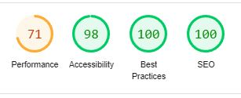

# ⚡️ https://maxxking.dev


# 💫 About
Hey there, thanks for checking out the code behind my online portfolio! This project is always evolving and may not be in a presesntable state (sorry). I implemented wide array of front-end skills when building this site to demonstrate as much expertise, across various tools and technologies, as possible due to limitations with hosting.


# 💻 Tech Stack:


# Google Lighthouse
Performance analysis and optimizations made using Google Lighthouse. Current score as of 2/9/24



# 🏃 Getting Started
This application requires ...

```git clone https://github.com/maxx-king/maxx-king.io.git```

```cd maxx-king.io```

```ng serve```


# 🚀 Deploy
Build: ```ng build --output-path docs --base-href /```

(failure to do the above will update the repo, but not the live site)

**Also recreate CNAM file in /docs (todo: add to build step)**

Commit: ```git commit -a -m "message here"```

Push: ```git push```


# 🛠️ TODO
### -> GA4?

### -> 404 page? 


### -> Hero Section:
        - Dynamic resize threejs container?
        - breakpoint to vertical align?

### -> About Section:
        - Too wordy
        - Better responsive layout

### -> Resume Section:
        - No scroll, make it fit

### -> Tech Stack Section:
        - Img src? or fix cropping issues
        - Dynamic loading animation, only once when coming into view for the first time

### -> Projects Section:
        - Change css, different from tech stack section
        - New image assets 
        - Refine text
        - Click to expand 4x size, embed image slider?
        - Dynamic loading animation, only once when coming into view for the first time

### -> Contact Section:
        - Change css, different from tech stack + projects section
        - Dynamic loading animation, only once when coming into view for the first time

### -> Navbar:
        - Sticky on bottom of hero section, 10vh
        - Smooth scroll to sections
        - Toggle light/dark mode?

### -> CSS breakpoints:
        - @media (max-width:800px)
        - mobile format? threejs considerations?